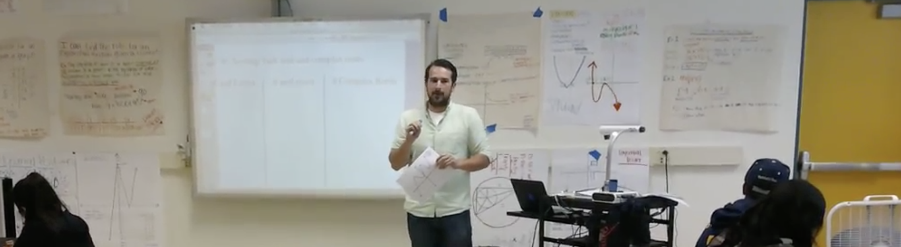

<h1 align="left">Hi 👋, I'm Matt!</h1>

- 🌱 I am a graduate of the Data Science Career  Track at Springboard, where I mastered skills in... 

   **Python, R, SQL, Machine Learning (supervised and unsupervised), Data Wrangling, Exploratory Data Analysis, Feature Engineering, Data Visualization, Predictive Modeling, Time Series Analysis, Classification and Clustering.**

- 👨‍💻 My  portfolio website can be found [here](https://merrillm1.github.io/)
- 📫 How to reach me : **matt.merrill94@gmail.com**

Profiles :

 

<!--
**merrillm1/merrillm1** is a ✨ _special_ ✨ repository because its `README.md` (this file) appears on your GitHub profile.

Here are some ideas to get you started:

- 🔭 I’m currently working on ...
- 🌱 I’m currently learning ...
- 👯 I’m looking to collaborate on ...
- 🤔 I’m looking for help with ...
- 💬 Ask me about ...
- 📫 How to reach me: ...
- 😄 Pronouns: ...
- ⚡ Fun fact: ...
-->
